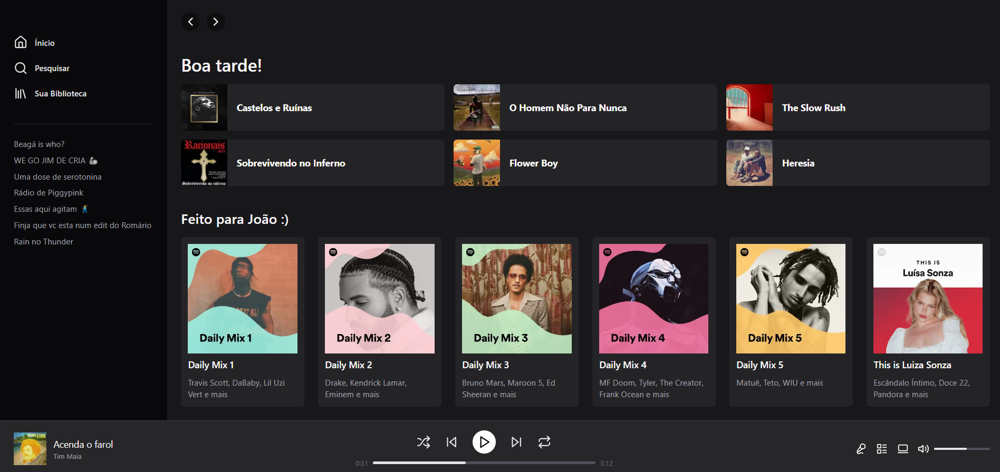

# Spotify Clone

Este projeto é um desafio pessoal para replicar a tela do **Spotify** utilizando **Next.js** e **Tailwind CSS**. O objetivo é aprimorar minhas habilidades de desenvolvimento front-end, explorando a criação de interfaces responsivas e atraentes.

## 🛠️ Tecnologias Utilizadas

- **Next.js**: Framework React para a construção de aplicações web otimizadas.
- **Tailwind CSS**: Framework CSS utilitário para estilização rápida e responsiva.

## 📸 Screenshots

    

## 🚀 Funcionalidades

- **Design Responsivo**: A interface se adapta a diferentes tamanhos de tela, garantindo uma boa experiência em dispositivos móveis e desktops.
- **Navegação**: Implementação de navegação entre seções, simulando a experiência do usuário no Spotify.
- **Estilização Atraente**: Uso de Tailwind CSS para criar um design limpo e moderno.

## 📝 Aprendizados

- **Next.js**: Aprendi a estruturar um projeto com Next.js e a implementar rotas.
- **Tailwind CSS**: Utilizei classes utilitárias para estilizar rapidamente a interface, economizando tempo e melhorando a consistência visual.
- **Desafios de Design**: A prática de replicar uma interface conhecida me ajudou a entender melhor como trabalhar com layouts complexos e responsivos.
